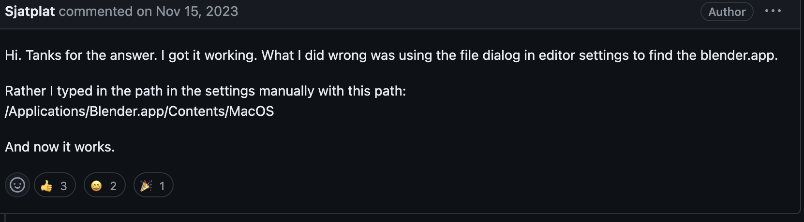

# Tutorials Used

## Basics of Godot and Blender Animation

### Tutorial Video

[Godot 4 / Blender - Third Person Character From Scratch](https://www.youtube.com/watch?v=VasHZZyPpYU)

### Why watch it

Learn how to create a controllable 3D character

### Contents and timestamps

- 00:53 - 19:30 : Blender modelling
- 19:31 - 30:30 : Blender rigging
- 30:31 - 44:05 : Blender animating
- 44:05 - end : Godot setup

## Animation State Machines

### Tutorial Video

[Animation Tree State Machine Setup w/ Conditions & BlendSpace2D - Godot 4 Resource Gatherer Tutorial](https://www.youtube.com/watch?v=WrMORzl3g1U)

### Why watch it

Learn how to setup a animation state machine to control the player model while the player performs different actions. For example, add a roll animation that triggers when the player presses space, and transition back and forth to a blendspace1D for standing still / running.

### Contents and timestamps

- 00:00 - 07:00ish : setup the state machine, setup transition parameters, set transition parameters in code

## Move Enemy Towards Player

## Dynamically Blending Animations

### Tutorial Video

[Godot Quick Tip - How to use AnimationTrees](https://www.youtube.com/watch?v=WY2cN9uG6W8&ab_channel=Miziziziz)

### Why watch it

Learn how to blend animations, including seperating upper/lower body for things like aiming a gun while running.

## Link Bone To Deform Model

[Assign Vertext Group To Specific Bone | Blender Rig Tutorial](https://www.youtube.com/watch?v=P47IpDEj2Y4&ab_channel=Himel356)

### Why Watch it

Quick explaination on how to create a vertex group, and link it to a bone for model deformation during posing / animating.

### Too Long, Didn't Watch

In edit mode on the model geometry, select a group vertexs, press ctrl+g, and "Assign to new vertex group". Name the vertex group in the "Data" tab on the bottom right (3 green boxes linked by green lines in inverted diamond formation). Set the bone to have the same name as the vertex group, and the bone will deform the vertex group when moved.

## Add Blender To Editor Settings in MacOs

Editor -> Editor Settings -> FileSystem -> Import -> Blender 3 Path

## Use Multiple GitHub Accounts From One Computer

### Tutorial Link

https://gist.github.com/rahularity/86da20fe3858e6b311de068201d279e3#file-work-with-multiple-github-accounts-md

### Why read it

In the case you have a GitHub account and want a seperate GitHub account specifically for game dev.

## Add SkeletonIK3D To Imported Blender Model

### Tutorial Link

https://www.youtube.com/watch?v=-JMKR2sjlkY&list=PLqbBeBobXe08DLRMDMyY2YXLx-Q4R9Ujl&index=5

### Contents and timestamps

- 0:00 - 1:09 : Add and configure the Godot SkeletonIK3D node

### Why watch it

The SkeletonIK3D Godot node is needed to layer player input control of a model ontop of an animation key framed in Blender. First minute of video is used as a quick reference on how to use a SkeletonIK3D. The rest of the video is not used atm.

SkeletonIK3D allows character upper body to aim towards where the camera is pointed, effectively "aiming" the characters upper body seperately from the legs. Used to give more control to the player.

### How it's used in this project

The SkeletonIK3D element is used to control the two spine bones to cause the upper body to twist to face the camera. The SkeletonIK3Ds target is set to a node3d which has it's rotation controlled in script to combie the x rotation of the cameras spring arm and the y rotation of the cameras spring arm pivot.
